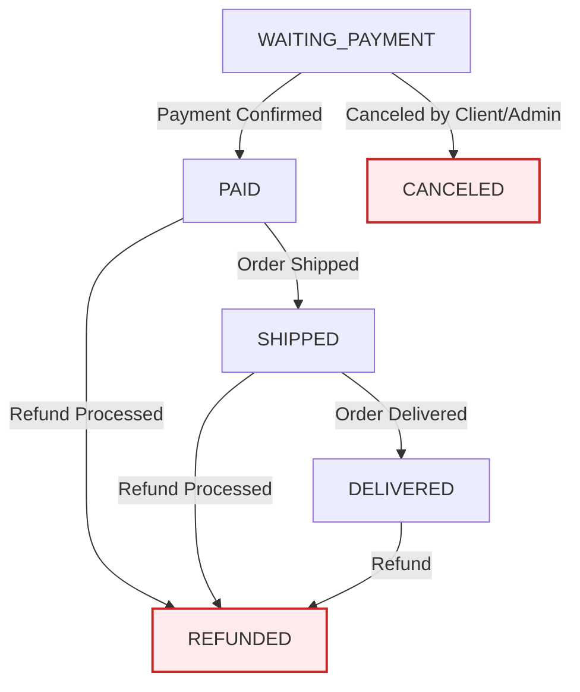

# Spring Boot REST API – E-commerce Backend
REST API built with Spring Boot and JPA simulating an e-commerce backend system, including users, products, categories, orders, and payments.

---

## Technologies
- Java 17
- Spring Boot 3
- Spring Data JPA (Hibernate)
- Spring Security + JWT
- Lombok
- PostgreSQL
- Bean Validation
- Maven
- SpringDoc OpenAPI (Swagger UI)

---

## Architecture
- RESTful API
- Layered architecture (**Controller / Service / Repository**)
- DTO pattern for data transfer
- Global exception handling with `@ControllerAdvice`
- Role-based access control (ADMIN / CLIENT)

---

## Features
- Full CRUD for Users, Products, Categories, and Orders
- JWT authentication and authorization
- Role-based access control (ADMIN/CLIENT)
- Password encryption with BCrypt
- Order creation with multiple items, automatic stock deduction and stock restoration on cancellation/refund
- Order status management with custom business workflow
- Order items include subtotal calculation (price × quantity)
- Order includes total price calculation
- Product–Category many-to-many relationship
- Input validation with Bean Validation
- Duplicate data protection (email and product/category name)
- Centralized exception handling
- Pagination support on all list endpoints using `@PageableDefault`
- Partial update support (send only the fields you want to update)
- Business rule: finalized orders (CANCELED/REFUNDED) cannot have status updated
- Automated payment lifecycle creation and clean-up
- API documentation with Swagger UI
- Sales report endpoint using Spring Data JPA interface-based projections

---

## Business Rules
- Each user can place multiple orders
- Each order can contain multiple products
- Each order item stores quantity and product price snapshot at purchase time
- Orders support status tracking:
  - `WAITING_PAYMENT`
  - `PAID`
  - `SHIPPED`
  - `DELIVERED`
  - `CANCELED`
  - `REFUNDED`
- Finalized orders (CANCELED/REFUNDED) cannot have their status updated
- Delivered orders (DELIVERED) can only be updated to `REFUNDED`
- Paid orders (PAID) can only be updated to `SHIPPED` or `REFUNDED`
- Shipped orders (SHIPPED) can only be updated to `DELIVERED` or `REFUNDED`
- Orders can only be deleted if their current status is `WAITING_PAYMENT`
- Clients can only cancel their own orders while in `WAITING_PAYMENT`
- Admins can update orders following the defined status workflow
  
---

### Status Rules
- **`WAITING_PAYMENT`** → `PAID` or `CANCELED`
- **`PAID`** → `SHIPPED` or `REFUNDED`
- **`SHIPPED`** → `DELIVERED` or `REFUNDED`
- **`DELIVERED`** → `REFUNDED`
- **`CANCELED`** and **`REFUNDED`** are final states.
  
## Access Control

| Role | Permissions |
|------|-------------|
| ADMIN | Full access to all endpoints |
| CLIENT | View own orders, create orders, cancel own orders (WAITING_PAYMENT only), update own profile |
| Public | View products and categories without authentication |

---

## How to Run
- Clone the repository
- Open the project in IntelliJ IDEA or Eclipse
- Configure your PostgreSQL database and set environment variables:
  - `DB_USERNAME` (default: postgres)
  - `DB_PASSWORD`
  - `JWT_KEY` (default key available in application-test.properties for testing)
- Run `DemoApplication`

Access API at:
- Swagger UI: `http://localhost:8080/swagger-ui/index.html`

### Swagger Overview

---

## Test Credentials
| User | Email | Password | Role |
|------|-------|----------|------|
| John Smith | john@gmail.com | 123456 | ADMIN |
| Jane Doe | jane@gmail.com | 123456 | CLIENT |
| Bob Johnson | bob@gmail.com | 123456 | CLIENT |
| Alice Brown | alice@gmail.com | 123456 | CLIENT |

---

## API Endpoints

### Auth
| Method | Endpoint | Description |
|--------|----------|-------------|
| POST | `/auth/login` | Authenticate and receive JWT token |

### Users
| Method | Endpoint | Description |
|--------|----------|-------------|
| GET | `/users` | List all users — ADMIN sees all, CLIENT sees only self (paginated) |
| GET | `/users/{id}` | Find user by id — ADMIN sees any, CLIENT sees only self |
| POST | `/users` | Create user (public) |
| PUT | `/users/{id}` | Update user profile (partial) — ADMIN updates any, CLIENT updates only self |
| PUT | `/users/{id}/password` | Update user password — ADMIN updates any, CLIENT updates only self |
| DELETE | `/users/{id}` | Delete user — ADMIN deletes any, CLIENT deletes only self |

### Products
| Method | Endpoint | Description |
|--------|----------|-------------|
| GET | `/products` | List all products (paginated) |
| GET | `/products/{id}` | Find product by id |
| POST | `/products` | Create product (ADMIN only) |
| PUT | `/products/{id}` | Update product (partial, ADMIN only) |
| DELETE | `/products/{id}` | Delete product (ADMIN only) |
| GET | `/products/category` | Find products by category id or name (paginated) |
| GET | `/products/search` | Search products by name or id using minified projection (paginated) |

### Categories
| Method | Endpoint | Description |
|--------|----------|-------------|
| GET | `/categories` | List all categories (paginated) |
| GET | `/categories/{id}` | Find category by id |
| POST | `/categories` | Create category (ADMIN only) |
| PUT | `/categories/{id}` | Update category (partial, ADMIN only) |
| DELETE | `/categories/{id}` | Delete category (ADMIN only) |

### Orders
| Method | Endpoint | Description |
|--------|----------|-------------|
| GET | `/orders` | List orders — ADMIN sees all, CLIENT sees own (paginated) |
| GET | `/orders/{id}` | Find order by id — ADMIN sees any, CLIENT sees only own |
| POST | `/orders` | Create order with items (automatic stock deduction) |
| PUT | `/orders/{id}` | Update order items — ADMIN updates any, CLIENT updates only own (only if WAITING_PAYMENT) |
| PUT | `/orders/{id}/status` | Update order status — ADMIN follows status workflow rules, CLIENT can only cancel own order (WAITING_PAYMENT only) |
| DELETE | `/orders/{id}` | Delete order — ADMIN deletes any, CLIENT deletes only own (only if WAITING_PAYMENT) |
| GET | `/orders/products-sales` | Sales report using database projections — ADMIN sees all sales, CLIENT sees only own purchases (paginated) |

### Payments
| Method | Endpoint | Description |
|--------|----------|-------------|
| GET | `/payments` | List all payments (ADMIN only, paginated) |
| GET | `/payments/{id}` | Find payment by id (ADMIN only) |
